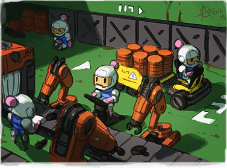

# Конкурс №120 "Bomberman II"

Работа на [конкурс проводимый на igdc.ru](http://igdc.ru/igdc_top.php?konkurs=120) с 8 по 23 марта.

Темой игры становится живая классика - bomberman. Главный герой передвигается по заполненному препятствиями уровню, закладывает бомбы с таймером и их взрывами разрушает препятствия и убивает врагов. Под разрушенными препятствиями можно найти бонусы и выход из уровня. Все просто.

Итак, основные требования:
* Герой.
* Враги.
* Препятствия.
* Бомбы.
* Сочные, эффектные и красивые взрывы. Обязательно. Желательно со звуком.

Вроде ничего не забыли.

Бонусы будем давать за качественные характеристики:
* Не менее 3-х бонусов или улучшений.
* Не менее 5 уровней или генератор случайных(только хороший).
* Не менее 3-х типов врагов с разным поведением. Можно больше.

Естественно можно и нужно делать свои классные штуки, расширяющие стандартный геймплей. Управление и игровые элементы можно менять по своему усмотрению. Детали тоже можно варьировать - вам решать, есть ли неразрушаемые препятствия и может ли герой погибнуть от своих же бомб. Главное, не потеряйте по пути Bomberman'а.

Конкурс продлится по 23 марта включительно. Ограничение на размер - 50 мб. Или докажите мне, что вам нужно больше.
