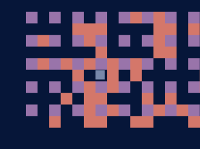
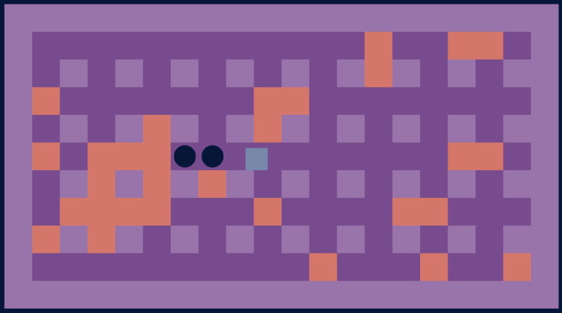
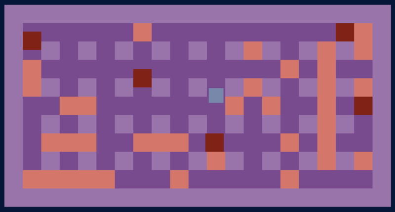
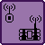
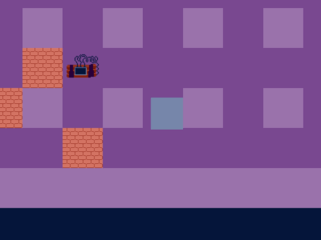
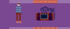
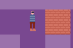
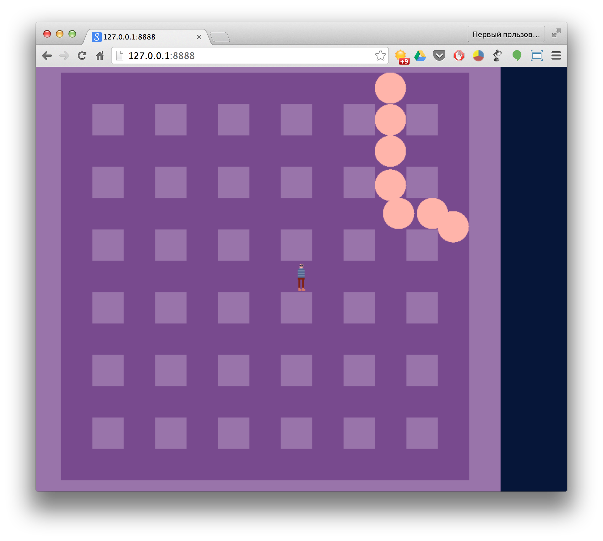

# Дневничок разработчика

## 11 марта 2015
Почти 10 лет назад, когдая работал над 128к-гоночками, я зачем-то писал [дневник разработчика](https://github.com/miriti/igdc09-race128k/blob/master/DevelopersLog.pas), где хотел описать все муки и страдания во время разработки. Сейчас читать это довольно забавно. И вот подумал, почему бы не попробовать сделать это еще раз? Если получится херня, то просто не буду прикладывать это дело к работе :)

Ну для начала надо описать текущую ситуацию? Загруз на работе позволяет как минимум пол дня заниматься своими делами. Собственно свои дела можно подвести под "самообучение", которое также заложено в рабочее время :) Главное чтобы не сильно отвлекали с другими проектами.

Прошло 2 дня с начала конкурса. Пока есть некоторое видение того, какой будет игра. Почему-то даже перед началом работы я явно увидел какой должна быть цветовая схема в игре и собственно с этого все и началось:

Опять же никак не могу избавиться от копания в движкописании. Это когда бОльшую часть времени занимаешься не собственно игрой и ее логикой, а выстраиванием идеальной архитектуры и абстракций. При этом совершенно очевидно, что все это не так уж важно на первом этапе, если будет время, то всегда можно сделать рефакторинг потом, а для начала таки всеже сделать игру. Постараюсь сегодня эту тенденцию переломить.

Пока все выглядит вот так:

Никаких коллизий, просто выводятся такие вот квадратики... Еще раз настраиваюсь на ощутимый прогресс сегодня.

---

Вот даже некоторый прогресс за последние 4 часа. И чем я только занимаюсь на рабочем месте... Надо бы работой заняться, с этим можно продолжить вечером.

---

Ну вот перед сном появились базовые враги. Хороший прогресс сегодня! Теперь спать.

---

## 12 марта 2015
Отлично. Загруз на работе все еще позволяет заниматься своими делами. И вместо того, чтобы заниматься чем-то действительно полезным, я занимаюсь вот этим вот всем бомберменом. За полтора часа на работе сделал таки нормальные взрывы. А то только по дороге на работу осознал, что в настоящий момент взрывная волна не останавливается при встрече с препятствиями.

Теперь все достаточно круто. Наверно можно уже приступать к графике. И надеюсь удастся сегодня вечером посидеть в **SunVox** и набросать какую-нибудь музычку. Утром были какие-то идеи, сейчас все выветрелось.

Да, игрок тут неуязвим.

---

## 15 марта 2015
За выходные удалось более-менее продуктивно поработать над игрой. Сначала хотел засесть за музыку в SunVox, но не особо пошло. Исправил дурацкий баг в коллизиях с бомбочкой. Главное достижение выходных это вот эти вот потрясающие образцы "пиксельарта":

  

А еще вот такие вот невероятные по своей зрелищности эффекты с частицами:

Нда...

----

Еще немного.. совсем немного прогресса. Нарисовал пару иконок. Нда.

 

Завтра надо будет сосредоточиться на врагах и их анимации.

---

## 16 марта 2015

Я уже начинаю ощущать что время начинает поджимать, а очень хочется успеть сделать побольше. Осталось меньше недели. Думаю что следует составить список задач и постараться придерживаться его. И так:

- [ ] **Сеттинг**. Уж не заню на сколько удастся вписать хоть какой-то сеттинг, но есть идея с хранилищем банка и его грабежом. Однако мне лень (нет способностей) рисовать сложных охранников с анимацией. Впрочем почему хранилище банка не могут охранять цудовища?
- [ ] **Враги**. Пока просто обозначу что врагов должно быть как минимум 3.
  - [ ] **Враг 1**
  - [ ] **Враг 2**
  - [ ] **Враг 3**
  - [ ] **Босс?** Очень хочется сделать червя. Думаю стоит попробовать.
- [ ] **Бонусы**. В целом система бонусов уже готова. Нужно только реализовать их непосредственный эффект. На настоящий момент работает только бонус с усилением бомбочки.
  - [x] Усиление бомбы
  - [x] Дополнительная бомба
  - [x] Радио бомба
  - [ ] **Бесконечные бомбы**
  - [ ] **Возможность проходить через бомбы**
  - [ ] **Неуязвимость перед бомбами**
- [ ] **Геймплей**
  - [ ] **Смерть**, перезапуск уровня, отнятие жизней.
  - [ ] **Таймер**. Важный момент! На прохождение уровня дается определенное время. По его истечении должно происходить что-то плохое.
  - [ ] **Бонус-уровни**. Нет преград, только враги, нужно успеть убить побольше. А какой приз?
  - [ ] **Последствия от взрыва бонуса или двери**
- [ ] **Графика**
  - [ ] **Игрок**
  - [ ] **Враги**
  - [ ] **Окружение**
- [ ] **Спецэффекты**
  - [ ] **Взрывы**
  - [ ] **Кровища, кишки, расчлененка**
  - [ ] **Всякие eye-candy** если будет время
- [ ] **Прочее**
  - [ ] **Главное меню!**
  - [ ] **Какой-нибудь HUD** (Жизни, время, бонусы, кол-во бомб и т.д.)
  - [ ] **Пауза**

Вот такой вот план пока что. Если сегодня что-то допридумаю/сделаю, то отмечу здесь же. А на следующие дни буду копировать список. Или может создать отдельный MD файл? История решения задач будет храниться в истории изменений git... Надо подумать. А пока есть время надо заниматься игрой.

---
Пара часов мучений и готовы вот такие взрывы. Даже не знаю..

---

## 18 марта 2015
А сегодня эти взрывы мне нравятся уже больше. Может быть не все так уж и плохо с моими способностями художника и аниматора. Вечером еще попробую порисовать персонажей.

Посление пару часов сидел и делал переход между уровнями. Еще не доделал, надо добавить вывод названия уровня и будет вообще круто. Правда не понимаю куда я потратил два часа? Даже больше. Я пришел на работу в 9.40, а сейчас уже половина второго, обед практически. Конечно не все это время я занимался игрой, однако все еще достаточно много времени, а результата не так много. Хотя пофиксил пару серьезных багов.

Надо пробежаться по списку...

Получается что из списка почти ничего не сделано :-D Раз уж начал, то пожалуй сделаю сегодня следующее:

- [ ] Смерть игрока, жизни.
- [ ] HUD. Отображать время уровня, жизни, кол-во бомб. А также выводить название уровня в интерлевеле.
- [ ] Настройка упроавления. Не очень приоритетно, но надо бы сделать.
- [ ] Главное меню посимпатичнее.
- [ ] Сделать вменяемые уровни, а не повторять один и тот же случайно генерируемый уровень.

Посмотрим что получится.

---
И так.
Из всего описанного выше сделал только смерть игрока. И жизни.
А еще вот такую вот анимацию персонажа. Даже не знаю кто это. Вор наверное.

И вот еще. Тут захватился кусочек межуровневой анимации (она же после сметри, как в данном случае).

---

## 19 марта 2015

Сегодня как-то все очень туго идет. Возможно сказывается отсутствие какой-либо работы на работе (хотя это плюс), а может быть накопилась какая-то усталось за неделю (хотя чего тут уставать? да и пятница завтра).

Тем не менее за рабочий день смог вымучать червя. Во всяком случае основу для него сделал. Не уверен что я занимаюсь чем надо, но червя хотелось сделать изначально. Пока он хаотично носится по коридорам (кстати если бы на карте были бы тупики, то червь бы завис). Нужно нарисовать ему какой-то тело вечером и придумать логику поведения. Хотя может быть и так нормально, нужно только сделать так, чтобы червь проходил сквозь кирпичные стены. Вот скриншот:

За одно можно заметить какая погода сегодня в Минске. Теплынь! Хотя утром было достаточно прохладно.

В целом я рад и такому прогрессу. Не забыть бы про кровищу.
